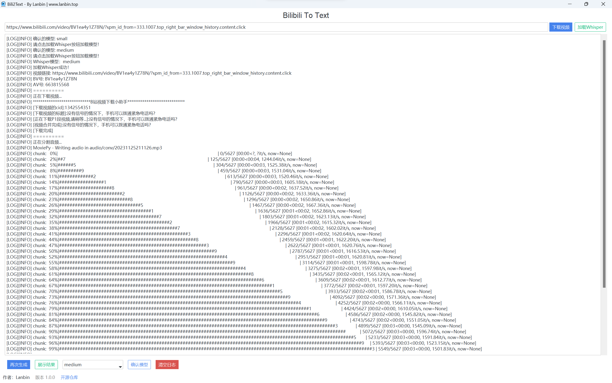
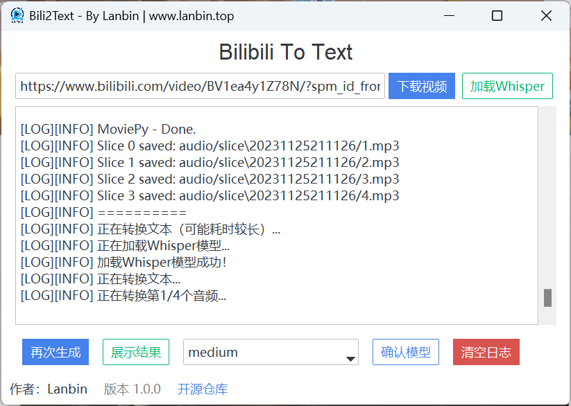
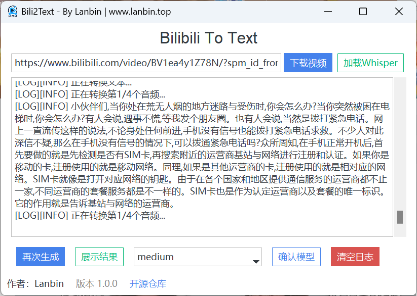

<p align="center">
  
</p>


<p align="center">
    
    
    
    
</p>

# Bili2text 📺

## 简介 🌟
bili2text 是一个用于将 Bilibili 视频转换为文本的工具🛠️。这个项目通过一个简单的流程实现：下载视频、提取音频、分割音频，并使用 whisper 模型将语音转换为文本。整个过程是自动的，只需输入 Bilibili 视频的 av 号即可。整个过程行云流水，一步到胃😂

## 功能 🚀
- 🎥**下载视频**：从 Bilibili 下载指定的视频。
- 🎵**提取音频**：从下载的视频中提取音频。
- 💬**音频分割**：将音频分割成小段，以便于进行高效的语音转文字处理。
- 🤖**语音转文字**：使用 OpenAI 的 whisper 模型将音频转换为文本。

## 使用方法 📘
1. **克隆仓库**：
   ```bash
   git clone https://github.com/lanbinshijie/bili2text.git
   cd bili2text
   ```

2. **安装依赖**：
   安装必要的 Python 库。
   ```bash
   pip install -r requirements.txt
   ```

3. **运行脚本**：
   使用 Python 运行 `main.py` 脚本。
   ```python
   python main.py
   ```

   在提示时输入 Bilibili 视频的 av 号。

4. **使用UI界面**：
   ```bash
   python window.py
   ```

   在弹出的窗口中输入视频链接，会自动转换为av号，点击下载视频按钮即可完成文件转换。

## 示例 📋
```python
from downBili import download_video
from exAudio import *
from speech2text import *

av = input("请输入av号：")
filename = download_video(av)
foldername = run_split(filename)
run_analysis(foldername, prompt="以下是普通话的句子。这是一个关于{}的视频。".format(filename))
output_path = f"outputs/{foldername}.txt"
print("转换完成！", output_path)
```

## 技术栈 🧰
- [Python](https://www.python.org/) 主要编程语言，负责实现程序逻辑功能
- [Whisper](https://github.com/openai/whisper) 语音转文字模型
- [Tkiner](https://docs.python.org/3/library/tkinter.html) UI界面展示相关工具
- [TTKbootstrap](https://ttkbootstrap.readthedocs.io/en/latest/zh/) UI界面美化库

## 后续开发计划 📅

- [X] 生成requirements.txt
- [X] UI化设计


## 运行截图 📷
<!-- assets/screenshot1.png -->




## 许可证 📄
本项目根据 MIT 许可证发布。

## 贡献 💡
如果你想为这个项目做出贡献，欢迎提交 Pull Request 或创建 Issue。

## 致谢 🙏
再此感谢Open Teens对青少年开源社区做出的贡献！[@OpenTeens](https://openteens.org)