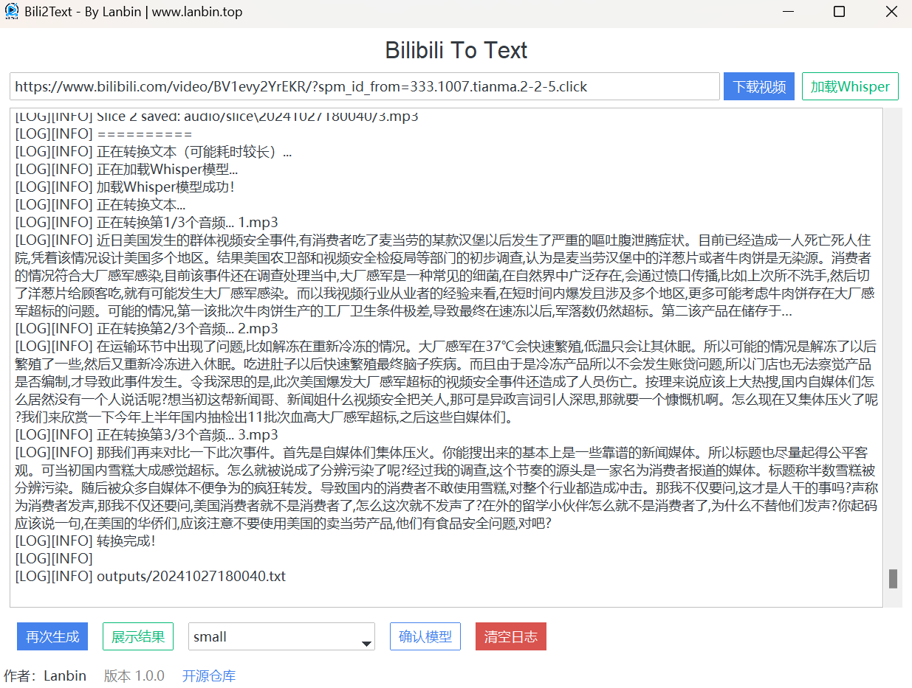

<p align="center">
  
</p>

<p align="center">
  <a href="README.en.md">English</a>
  ·
  <a href="CHANGELOG.md">更新日志</a>
</p>

<p align="center">
  
  
  
  
  
  
</p>

# bili2text

**bili2text** 是一个把 Bilibili 视频转成文字的命令行工具。

贴一个 Bilibili 链接或 BV 号进去，它会自动下载视频、提取音频、跑语音识别，最后输出一份文字稿。支持多种转写引擎，可以在本地离线跑，也可以接云端服务。

除了命令行，还附带了简单的 Web 界面和桌面窗口，方便不习惯终端的用户使用。



*PS：这个是老的界面截图*

## 支持的转写引擎

| 引擎 | 类型 | 说明 |
| --- | --- | --- |
| **Whisper** | 本地模型 | OpenAI 开源的语音识别模型，离线运行，通用性强 |
| **SenseVoice** | 本地模型 | 阿里云开源本地语音识别模型，中文识别效果好 |
| **火山引擎** | 云端 API | 字节跳动旗下的商用语音识别服务，识别很准很推荐 |

## 快速开始

### 安装

需要 Python 3.10–3.12 和 [uv](https://docs.astral.sh/uv/)。

`uv` 是一个现代化的 Python 包管理工具，速速扔掉你手中的 Conda、Anaconda、venv和pip吧！

```bash
git clone https://github.com/lanbinleo/bili2text.git
cd bili2text
uv sync
```

这只会安装核心依赖。转写引擎和额外功能需要通过 extras 安装，比如要用 Whisper 和 Web 界面：

```bash
uv sync --extra whisper --extra web
```

可选的 extras：`whisper`、`sensevoice`、`volcengine`、`web`、`server`。可以暂时不用安装，详看下方的初始化文档。

#### 准备 SenseVoice ONNX 模型

选择 SenseVoice 时，先下载 [`iic/SenseVoiceSmall-onnx`](https://modelscope.cn/models/iic/SenseVoiceSmall-onnx) 到本地目录。该 ONNX 仓库缺少运行时必需的 `chn_jpn_yue_eng_ko_spectok.bpe.model`，还需要从 [`iic/SenseVoiceSmall`](https://modelscope.cn/models/iic/SenseVoiceSmall) 下载这个同名文件，并放进同一目录。最终目录至少应包含：

```text
config.yaml
am.mvn
chn_jpn_yue_eng_ko_spectok.bpe.model
model_quant.onnx  # 官方量化模型；也支持非量化 model.onnx
```

配置向导中的 SenseVoice 模型目录应指向这个目录。bili2text 会根据 `model_quant.onnx` 或 `model.onnx` 自动选择量化模式，并在文件不完整时列出缺失项。

### 初始化配置

第一次运行时会自动弹出配置向导，也可以手动运行：

```bash
uv run bili2text init
```

向导会引导你选择语言、转写引擎和额外功能，最后告诉你需要运行什么安装命令。

### 转写视频

```bash
uv run bili2text tx "https://www.bilibili.com/video/BV1kfDTBXEfu"
```

也可以传本地文件：

```bash
uv run bili2text tx ./my-video.mp4
```

指定引擎和模型：

```bash
uv run bili2text tx "BV1kfDTBXEfu" --provider whisper --model medium
```

批量提交多条输入：

```bash
uv run bili2text batch "BV1kfDTBXEfu" "https://www.bilibili.com/video/BV1xx411c7XD"
```

也可以用文本文件，每行一个 BV、链接或本地文件路径：

```bash
uv run bili2text batch --file sources.txt
```

## 命令一览

| 命令 | 缩写 | 说明 |
| --- | --- | --- |
| `bili2text transcribe` | `tx` | 转写视频或音频 |
| `bili2text batch` | - | 批量转写多条输入 |
| `bili2text bootstrap` | `init` | 配置向导 |
| `bili2text web` | `ui` | 启动 Web 界面 |
| `bili2text server` | `srv` | 启动服务模式 |
| `bili2text window` | `win` | 启动桌面窗口 |
| `bili2text doctor` | `diag` | 检查运行环境 |
| `bili2text language` | `lang` | 切换界面语言 |

```bash
uv run bili2text --help
```

## Web 界面 & 服务模式

启动 Web 界面（浏览器访问）：

```bash
uv run bili2text ui
```

以服务模式运行（适合 Docker 或局域网部署）：

```bash
uv run bili2text srv --host 0.0.0.0 --port 8000
```

*注意，项目暂时未对Docker或服务器类型的长时间运行做任何优化，请暂时使用本地端*

## 开发

- [开发文档](docs/DEVELOPMENT.md)
- [更新日志](CHANGELOG.md)

## 许可证

MIT License

## 使用须知

使用本工具时，请遵守你所在地区的版权法律与平台规则。确保你有权下载和转写相关视频内容。

开发者不对任何非法使用行为负责。
